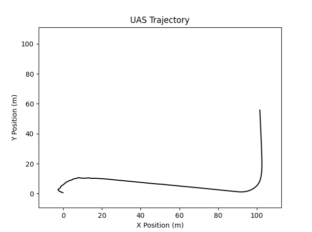

# UAS_Sim

Basic UAS/Drone 2D C++ simulation platform

## Current Capabilities

- Waypoint Navigation 
- Configurable GPS sensor (Noise, Update Frequency)
- Extended Kalman Filter state estimation
- Basic UAS capability configuration (speed range and acceleration capability)

## Future Plans 

- IMU sensor and sensor fusion capabilities
- DDIL environment communication simulation
- Threat Detection and Task types for evasive movement & engagements

## To run (Visual Studio) using CMake
From project root

- Build solution:
cmake --build out/build/x64-debug --target UAS_Sim

- Run Executable:
.\out\build\x64-debug\UAS_Sim.exe

- Visualisations: (in Results folder)
python python/plot_results.py

## Example Simulation Result

