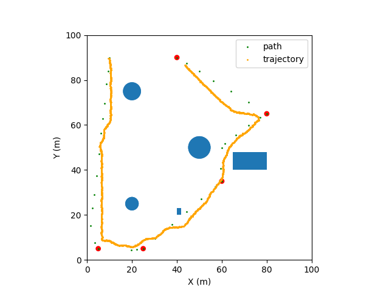

# UAS Sim

Basic 2D UAS/drone simulation platform written in C++.

**Latest update:** v1.3 — Object avoidance

## Current capabilities

- Waypoint navigation using RRT* path planning and Pure Pursuit path following
- Configurable GPS sensor noise and update frequency
- Extended Kalman Filter state estimation
- Configurable UAS speed, acceleration, and turn-rate limits

## Future plans

- IMU sensor and sensor-fusion capabilities
- DDIL environment communication simulation
- Threat detection and task types for evasive movement and engagements

## Run with Visual Studio and CMake

Select a simulation in `main.cpp` from `SimulationCatalogue`:

- `WaypointNavigation` — Two UAVs navigate square waypoint routes using simple navigation.
- `ObstacleCourseNavigation` — One UAV navigates a static obstacle course using RRT* and Pure Pursuit.

From the project root:

```powershell
cmake --build out/build/x64-debug --target UAS_Sim
.\out\build\x64-debug\UAS_Sim.exe
```

## Visualisation

```powershell
python python/plot_results.py  # Trajectory GIF
python python/plot_map.py      # Obstacles, planned route, and trajectory
```

## Example result


